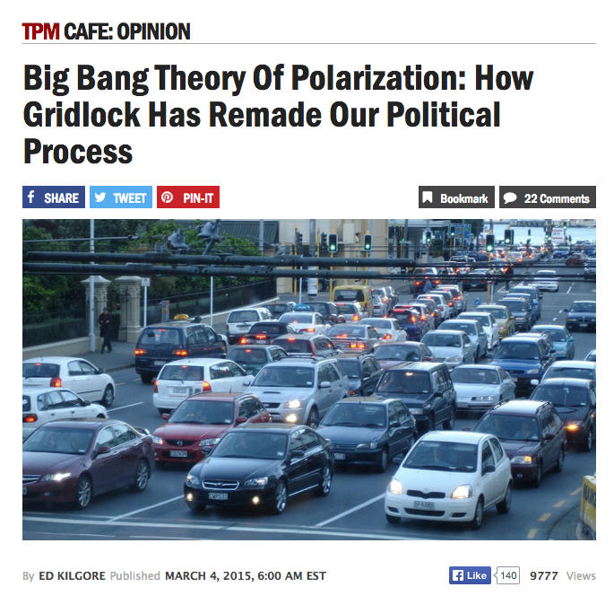

## Changing Preferences in Congress?
<a href = "http://talkingpointsmemo.com/cafe/the-big-bang-theory-of-political-polarization-congress-gridlock"></a>
* Legislators in recent Congresses are more polarized than [ever](http://www.nationaljournal.com/2013-vote-ratings/the-most-divided-congress-ever-at-least-until-next-year-20140206).
* Increased polarization is [responsible for gridlock.](http://www.washingtonpost.com/blogs/monkey-cage/wp/2014/01/13/how-political-polarization-creates-stalemate-and-undermines-lawmaking/)
* Are legislators really more polarized today than during the Civil War?


--- .class #id 

## Measuring Legislator Preferences
* "Ideal point estimation" uses roll call voting records to calculate measures of legislators' preferences.
  * Start with a matrix of roll call votes (0 = nay, 1 = yea).
  * The probability that member $i$ votes "yea" on a bill ($y_{it}=1$) is:
$$  Pr(y_{it}=1)=F(\alpha_{t}+\beta_{t}x_{i}) $$
where $\alpha_{t}$ is the probability of voting “yea” on vote $t$ regardless of a member’s ideal point, and $\beta_{t}$ is the probability of voting “yea” that reflects the member’s ideal point $x_{i}$.
  * Constrain outcomes [-1,1], where conservative preferences are typically associated with positive ideal points.
* DW-NOMINATE scores measures the ideal points of legislators who served in the 1st-113th Congresses. 
  * Comparable over time: use legislators who served in multiple Congresses to "bridge." 
  * More info: http://voteview.com/dwnomin.htm

--- .class #id 
## Preferences in the U.S. House of Representatives

```{r, echo = FALSE, warnings = FALSE, message=FALSE, fig.width=13}
library(foreign)
library(ggplot2)
library(gridExtra)
setwd("~/Dropbox/Programming/DataProducts/courseProject1")
nom<-read.dta("nomData.DTA")
nom<-subset(nom, cong >=37)
nom$party[nom$party != 100 & nom$party != 200]<-300
nom37<-subset(nom, cong == 37)
c37<-ggplot(nom37, aes(x=dwnom1, fill=factor(party))) +geom_density(alpha=.5) +
    scale_fill_manual(values = c("blue","red", "green"))+ xlab("DW-NOMINATE Ideal Point") +
    theme(legend.position = "none") + ggtitle("37th Congress (1861-1863)")
nom52<-subset(nom, cong == 52)
c52<-ggplot(nom52, aes(x=dwnom1, fill=factor(party))) +geom_density(alpha=.5) +
    scale_fill_manual(values = c("blue","red", "green"))+ xlab("DW-NOMINATE Ideal Point") +
    theme(legend.position = "none") + ggtitle("52nd Congress (1891-1893)")
nom67<-subset(nom, cong == 67)
c67<-ggplot(nom67, aes(x=dwnom1, fill=factor(party))) +geom_density(alpha=.5) +
    scale_fill_manual(values = c("blue","red", "green"))+ xlab("DW-NOMINATE Ideal Point") +
    theme(legend.position = "none") + ggtitle("67th Congress (1921-1923)")
nom82<-subset(nom, cong == 82)
c82<-ggplot(nom67, aes(x=dwnom1, fill=factor(party))) +geom_density(alpha=.5) +
    scale_fill_manual(values = c("blue","red", "green"))+ xlab("DW-NOMINATE Ideal Point") +
    theme(legend.position = "none") + ggtitle("82nd Congress (1951-1953)")
nom97<-subset(nom, cong == 97)
c97<-ggplot(nom97, aes(x=dwnom1, fill=factor(party))) +geom_density(alpha=.5) +
    scale_fill_manual(values = c("blue","red", "green"))+ xlab("DW-NOMINATE Ideal Point") +
    theme(legend.position = "none") + ggtitle("97th Congress (1981-1983)")
nom113<-subset(nom, cong == 113)
c113<-ggplot(nom113, aes(x=dwnom1, fill=factor(party))) +geom_density(alpha=.5) +
    scale_fill_manual(values = c("blue","red", "green"))+ xlab("DW-NOMINATE Ideal Point") +
    theme(legend.position = "none") + ggtitle("113th Congress (2013-2015)")
plot<-grid.arrange(c37, c52, c67, c82, c97, c113, nrow=2)
```

Legend: <span style="color:blue">Democrats</span>, <span style="color:red">Republicans</span>, and <span style="color:green">Other</span>


--- .class #id 
## Preferences in the Senate
```{r, echo = FALSE, warnings = FALSE, message=FALSE, fig.width=13}
library(foreign)
library(ggplot2)
library(gridExtra)
setwd("~/Dropbox/Programming/DataProducts/courseProject1")
nomS<-read.dta("nomDataS.DTA")
nomS<-subset(nomS, cong >=37)
nomS$party[nomS$party != 100 & nomS$party != 200]<-300
nomS37<-subset(nomS, cong == 37)
cS37<-ggplot(nomS37, aes(x=dwnom1, fill=factor(party))) +geom_density(alpha=.5) +
    scale_fill_manual(values = c("blue","red", "green"))+ xlab("DW-NOMINATE Ideal Point") +
    theme(legend.position = "none") + ggtitle("37th Congress (1861-1863)")
nomS52<-subset(nomS, cong == 52)
cS52<-ggplot(nomS52, aes(x=dwnom1, fill=factor(party))) +geom_density(alpha=.5) +
    scale_fill_manual(values = c("blue","red", "green"))+ xlab("DW-NOMINATE Ideal Point") +
    theme(legend.position = "none") + ggtitle("52nd Congress (1891-1893)")
nomS67<-subset(nomS, cong == 67)
cS67<-ggplot(nomS67, aes(x=dwnom1, fill=factor(party))) +geom_density(alpha=.5) +
    scale_fill_manual(values = c("blue","red", "green"))+ xlab("DW-NOMINATE Ideal Point") +
    theme(legend.position = "none") + ggtitle("67th Congress (1921-1923)")
nomS82<-subset(nomS, cong == 82)
cS82<-ggplot(nomS67, aes(x=dwnom1, fill=factor(party))) +geom_density(alpha=.5) +
    scale_fill_manual(values = c("blue","red", "green"))+ xlab("DW-NOMINATE Ideal Point") +
    theme(legend.position = "none") + ggtitle("82nd Congress (1951-1953)")
nomS97<-subset(nomS, cong == 97)
cS97<-ggplot(nomS97, aes(x=dwnom1, fill=factor(party))) +geom_density(alpha=.5) +
    scale_fill_manual(values = c("blue","red", "green"))+ xlab("DW-NOMINATE Ideal Point") +
    theme(legend.position = "none") + ggtitle("97th Congress (1981-1983)")
nomS113<-subset(nomS, cong == 113)
cS113<-ggplot(nomS113, aes(x=dwnom1, fill=factor(party))) +geom_density(alpha=.5) +
    scale_fill_manual(values = c("blue","red", "green"))+ xlab("DW-NOMINATE Ideal Point") +
    theme(legend.position = "none") + ggtitle("113th Congress (2013-2015)")
plot<-grid.arrange(cS37, cS52, cS67, cS82, cS97, cS113, nrow=2)
```

Legend: <span style="color:blue">Democrats</span>, <span style="color:red">Republicans</span>, and <span style="color:green">Other</span>


