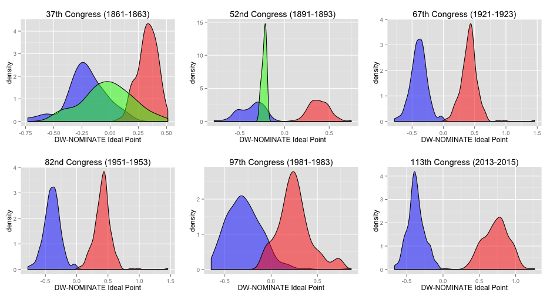
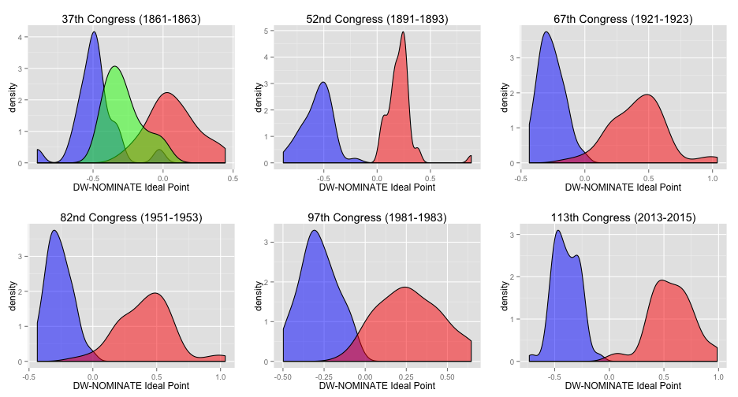

## Changing Preferences in Congress?

* Legislators in recent Congresses are more polarized than [ever](http://www.nationaljournal.com/2013-vote-ratings/the-most-divided-congress-ever-at-least-until-next-year-20140206).
* Increased polarization is [responsible for gridlock.](http://www.washingtonpost.com/blogs/monkey-cage/wp/2014/01/13/how-political-polarization-creates-stalemate-and-undermines-lawmaking/)
* Are legislators really more polarized today than during the Civil War?

--- .class #id 

## Measuring Legislator Preferences
* "Ideal point estimation" uses roll call voting records to calculate measures of legislators' preferences.
  * Start with a matrix of roll call votes (0 = nay, 1 = yea).
  * The probability that member $i$ votes "yea" on a bill ($y_{it}=1$) is:
$$  Pr(y_{it}=1)=F(\alpha_{t}+\beta_{t}x_{i}) $$
where $\alpha_{t}$ is the probability of voting “yea” on vote $t$ regardless of a member’s ideal point, and $\beta_{t}$ is the probability of voting “yea” that reflects the member’s ideal point $x_{i}$.
  * Constrain outcomes [-1,1], where conservative preferences are typically associated with positive ideal points.
* DW-NOMINATE scores measures the ideal points of legislators who served in the 1st-113th Congresses. 
  * Comparable over time: use legislators who served in multiple Congresses to "bridge." 
  * More info: http://voteview.com/dwnomin.htm

--- .class #id 
## Preferences in the U.S. House of Representatives

 

Legend: Democrats, Republicans, and Other

--- .class #id 
## Preferences in the Senate
 

Legend: Democrats, Republicans, and Other

